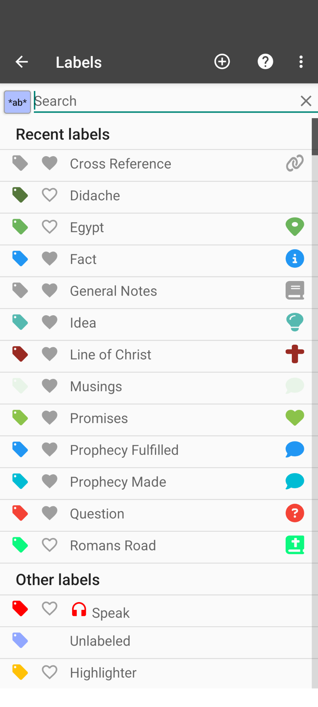

# Labels

## Overview

Labels are a way to tag a piece of information in *AndBible*. Labels can be assigned
to bookmarks, study pads, and personal notes.

## Open Label settings

To manage and see a list of all of your labels:

1. Click the vertical ‘three-dot’ menu on the top right of the main toolbar.
2. Click *Label settings…*.

Alternatively, when creating a bookmark, you can assign and manage labels by
clicking on the *Select or edit labels…* button on the bottom of the
*Bookmark Labels* dialog.

[{ .align-center style="width: 200px" }](images/label-settings-dialog.png)

## Searching for a Label

If many labels exist, it may be helpful to search for specific labels:

1. [Open Label settings](#open-label-settings)
2. Begin typing the name (or part of the name) of the label you want to find.
    (The results will automatically filter as you type)

## Create a label

To create a label:

1. [Open Label settings](#open-label-settings)
2. Click the *Plus* (+) button at the top
3. Enter a label name.
4. Optionally, [Change Label Settings](#change-label-settings)

## Delete a label

To delete a label:

1. [Open Label settings](#open-label-settings)
2. Click the label you would like to delete.
3. Click the Trash icon in the top right.
4. Click *Yes* to confirm deletion. (This will remove the label from all
    bookmarks, notes, and associated Study Pad.)

## Change Label Settings

Various label settings exist to apply different styling to and make assigning the
label easier. You can:

> - Change the color of a label by clicking the label icon next to the label name.
> - Favorite a label to make it easier to select when assigning bookmark labels.
> - Assign a custom marker icon to a label.
>     (The custom icon will be used as the bookmark icon if the label is the
>     primary label on the bookmark)
> - Have either an underline or background coloring style.
> - Hide the label from applying any kind of styling (or visible icon) to the bookmark.
> - ‘Auto-assign’ labels to new bookmarks. (This applies to the active workspace)
> - Set the label as the ‘main label’ for new bookmarks.
>     (The *main label* is the label that is listed first and determines the style
>     of the bookmark)

## Override Label Style per Workspace

By default, a label’s display style (highlight, underline, marker, or hidden)
is the same across all workspaces. You can override the display style for a
specific workspace so that the same label appears differently depending on
which workspace you are in.

For example, you might want a label to show as a colored highlight in your
study workspace but be hidden in your reading workspace.

To set a workspace-specific style override:

1. [Open Label settings](#open-label-settings)
2. Click the label you want to override.
3. Scroll down to the **This workspace** section.
4. Under **Override style**, select the desired display mode:

    - **Highlight** — colored background
    - **Underline** — underline style
    - **Marker only** — small marker icon, no highlight or underline
    - **Hidden** — bookmark is not visible

    The option that corresponds to the label’s global style is marked with
    *(no override)*. Selecting it removes the workspace override.

Labels that have a workspace-specific override are indicated with a small
tune icon in the label list.

## Video

https://www.youtube.com/watch?v=0AwBktLOup8
