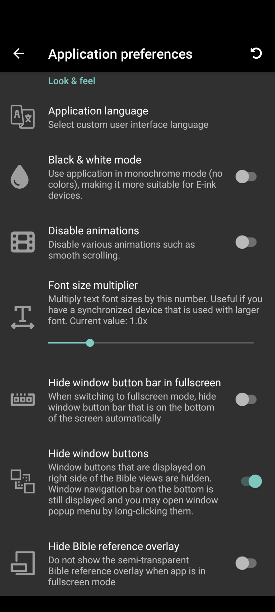
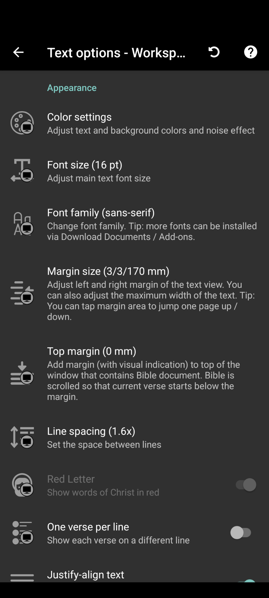
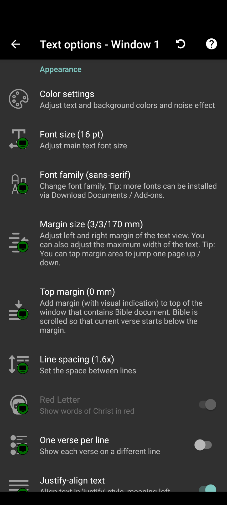

# Look and Feel

The look and feel of *AndBible* can be configured at several levels: for the entire
application, as global defaults, for specific workspaces, for individual
windows, or even for particular modules.

## Text display settings hierarchy

Text display settings (formatting, fonts, colors, etc.) follow a three-level
hierarchy. Each level inherits from the one above it, so you only need to
change a setting at the level where you want it to differ.

1. **Global defaults** – apply to all workspaces and windows everywhere.
2. **Workspace settings** – override global defaults for one workspace and all
    its windows.
3. **Window settings** – override the workspace setting for one specific
    window.

When you change a setting at a higher level, all lower levels that have not
been explicitly overridden will automatically follow the change. For example,
if you set the global font size to 16 pt and a workspace has no font size of
its own, it uses 16 pt. If you then change the global font size to 14 pt, that
workspace (and all its windows) will switch to 14 pt as well.

A setting that has been explicitly set at a lower level is called an
**override**. Overrides are not affected by changes at higher levels. For
example, if you set a workspace font size to 18 pt, changing the global font
size will not affect that workspace. You can remove an override at any time to
go back to inheriting from the parent level.

**Visual indicators** in the text options screens show where each setting comes
from:

- ⚙ **Settings gear icon** – the setting is inherited from
    global defaults.
- ■ **Gray workspace icon** – you are editing a workspace
    default (affects all its windows).
- □ **Green workspace icon** – the window setting is using the
    workspace default.
- **No icon** – the setting has been explicitly changed at this level
    (overrides the parent).

You can navigate between levels directly from the text options screen. At the
window level, links to the workspace and global settings are shown at the top.
At the workspace level, a link to the global settings is shown. This makes it
easy to see and adjust settings at every level without leaving the settings
screen.

## Application settings

To configure application-wide settings (which are not synced to other devices),
navigate to the top left main menu (☰) and click `Settings`. These
settings apply to the local device only and are separate from the text display
settings hierarchy described above.

### General

- **Application language:** Choose the language for the application interface
    (dialogs, menus, settings).
- **Night mode:** Control when the dark theme is used:

    - *Manual* (default) – toggle dark mode from the three-dot menu.
    - *Automatic* – switch based on time of day.
    - *System* – follow the Android system dark mode setting (Android 10+).
- **Format for new bookmark notes:** Choose whether new [notes](notes.md)
    are created with the **HTML** editor or the **Markdown** editor. Existing
    notes keep the format they were created with.

### E-Ink Displays

- **Color mode:** Choose how colors are displayed throughout the application:

    - *Normal* – use the configured colors.
    - *Black & white* – convert colors to grayscale, retaining shades of grey.
    - *Color e-ink* – use a black-and-white base while keeping bookmark colors,
        the active-window indicator and helper lines in color. Intended for
        color e-ink screens.
    - *Monochrome* – use black ink on white paper, or white ink on black paper
        in the dark theme. Disabled controls and off states use one solid grey
        rather than faded shades. Highlighted bookmarks have frames instead of
        grey background fills. Recommended for e-ink screens where lighter grey
        levels fade or disappear.

    Monochrome is the default on Onyx devices when no Color mode has been
    chosen; other devices default to Normal. An existing saved choice is not
    changed, including Black & white on an Onyx device. Changing Color mode
    does not replace your configured colors; color-selection swatches still
    show those colors. Images are not restricted to black and white.
    In Monochrome, the reading pane's scrollbars use black and white on
    Android 10 and newer. On Android 6–9, these scrollbars are hidden because
    those versions do not provide a supported way to recolor them; scrolling
    still works normally.
- **Disable animations:** Turns off smooth scrolling and transition animations.
    Improves responsiveness on e-ink screens and very old devices. This is a
    separate setting; choosing a Color mode does not toggle it.

In Monochrome, progress heatmaps use three states instead of a color gradient:
**grey** means no activity or progress, **outlined** means partial progress or
an intermediate activity level, and **filled** means full progress or the
highest level. Ink and paper swap in the dark theme. In reading progress, a
filled book cell means at least 100% read; in memorization progress, a filled
cell means level 4/4. For reading
counts and calendar activity, filled means the highest count bucket, not that
all reading is complete. The legend explains these three states rather than
showing a gradual color scale.

Exact values remain available: select a book to see its percentage below the
book grid. Chapter cells show the read count (for example, `17 x`) or
memorization level (for example, `3/4`) before you tap to open the chapter.
Select a calendar day to see its activity count below the heatmap, including
zero for a day with no activity; days with activity also open the day's history.

Color mode and Disable animations can be used together for an e-ink reading
experience.

### Font and Text

- **Font size multiplier:** A global scaling factor (10%–500%) applied to all
    document text. Useful when you synchronize workspaces across devices with
    different screen sizes – the workspace font size is synced, but the
    multiplier is per-device. For example, setting 150% on a small phone while
    leaving 100% on a tablet keeps text proportional.

### Fullscreen and Window Display

- **Hide window button bar in fullscreen:** Hides the bottom window buttons
    when in fullscreen mode for a distraction-free view.
- **Hide window buttons:** Hides the menu buttons at the top right of each
    window. You can still access the window menu by long-pressing the buttons in
    the bottom window bar.
- **Hide Bible reference overlay:** Hides the semi-transparent Bible reference
    indicator that normally appears near the bottom of the screen in fullscreen
    mode.
- **Show active window indicator:** Highlights the corners of the active window
    with a colored border. Makes it easier to see which window is currently
    active when using multiple windows side by side.

### One-Tap Actions

When you tap on a verse or text, a quick action bar appears. You can customize
which buttons are shown in this bar:

- **One-tap actions (Bibles):** Configure which actions appear when tapping
    text in Bible documents. Available actions include: Bookmark, Bookmark with
    note, My Notes, Share, Compare, Speak, and Memorize.
- **One-tap actions (Other documents):** Configure which actions appear for
    non-Bible documents (commentaries, books, etc.). Available actions include:
    Bookmark, Bookmark with note, and Speak.

### Study Pad

- **Disable Study Pad click-to-edit:** When enabled, notes in Study Pads can
    only be edited by tapping the edit button, not by clicking on the note text
    directly. This prevents accidental edits while reading.

[{ .align-center width="259" height="576" }](images/application-look-and-feel.png)

## Global text options

Global text options are the default text display settings for all workspaces.
Any workspace or window that has not explicitly overridden a setting will use
the global value.

To access global text options:

- From a **workspace** text options screen, tap the **Global text options**
    link at the top.
- From a **window** text options screen, tap the **Global text options** link
    at the top.

When you change a global setting, the change is immediately reflected in every
workspace and window that is still inheriting that setting. Workspaces or
windows that have their own override are not affected.

Global text options are synced across devices.

The available settings are the same as those described in the [Formatting](#formatting-options) and
[Text Appearance](#text-appearance-options) sections below.

## Workspace text options

To configure the look and feel of an individual workspace, click on the three
dot kebab menu on the top right of your workspace. From there click on
`All Text Options`.

Workspace text options override the global defaults for that workspace and all
its windows. These settings are synced across devices.

**Formatting**

- **Section titles:** Show non-canonical section titles added by translators.
- **Title scroll button:** Show a small button next to section titles that
    scrolls to the top of the section when tapped.
- **Verse numbers:** Show or hide chapter and verse numbers.
- **Footnotes:** Show footnotes if available in the document. Optionally
    display them inline rather than in a popup.
- **Cross references:** Show cross-reference markers. Optionally expand them
    inline to see referenced text directly.
- **Strong’s numbers:** Show links to Greek and Hebrew dictionary definitions.
- **Morphological codes:** Show Robinson’s Greek morphology codes.
- **Italicize added words:** Italicize words that do not have Strong’s numbers
    associated with them. Useful for translations like KJV where added words are
    traditionally shown in italics.
- **Infinite scroll:** Automatically load more content when you scroll to the
    end of a chapter.

**Text Appearance**

- **Colors:** Adjust text color, background color, and background noise
    (a subtle texture overlay on the background).
- **Font size:** Set the base text size in points.
- **Font family:** Change the typeface. Additional fonts can be installed via
    font add-on modules.
- **Margin size:** Set the left and right margins independently, measured in
    millimeters. You can also set a maximum text width to prevent lines from
    becoming too long on wide screens.
- **Top margin:** Add a margin at the top of the window (in millimeters). The
    reading position starts below this margin.
- **Line spacing:** Adjust the space between lines (multiplier from 1.0x to
    2.0x).
- **Paragraph spacing:** Adjust the space between paragraphs (in millimeters).
- **Red letter:** Show the words of Christ in red.
- **One verse per line:** Display each verse on a separate line.
- **Justify text:** Align text to both left and right margins.
- **Hyphenation:** Automatically hyphenate words at line breaks (if supported
    by the language).
- **Relative page number:** Show a page number overlay indicating your position
    relative to where you started reading.

[{ .align-center width="259" height="576" }](images/workspace-appearance.png)

## Window text options

When using multiple windows, you can customize the text options of each
individual window to override the workspace settings. To change window text
options:

> 1. Tap and hold the square window icon at the bottom for the window you
>     would like to customize.
> 2. Click `Text Options`, then click `All Text Options`.

All of the same options that you could configure at the [workspace](#id2) level can be overridden for the selected window.
In the screenshot below you can see that the window color settings are
overriding the workspace color settings (indicated by the missing workspace
icon). To reset all window settings back to the workspace defaults, you can
click the circular back arrow at the top right of the window settings screen.

From the window text options screen you can also navigate directly to the
workspace or global text options using the links at the top of the screen.

[{ .align-center width="259" height="576" }](images/window-appearance.png)

## Module

For things that can not be changed through global, workspace, or window
settings, like the color of certain text within a module, e.g. Headings or
Strong’s numbers, you can code the color in the style.css file located within
the module’s zip package. You can see some examples of this being implemented here:

> - <https://github.com/AndBible/special-modules/tree/master/HISB/modules/texts/ztext/HISB/style>
> - <https://github.com/AndBible/special-modules/tree/master/StyleExample/modules/texts/ztext/StyleExample/style>

For more details on how to create custom CSS modules, see [Custom CSS](customisation/custom_css.md)
and placement of this file, it should be located in the *modules/texts/ztext/hisb/style*
directory.

Once the customized module is coded, you can follow the steps in
[Backup and Restore](backup_restore.md) to load your customized module.
