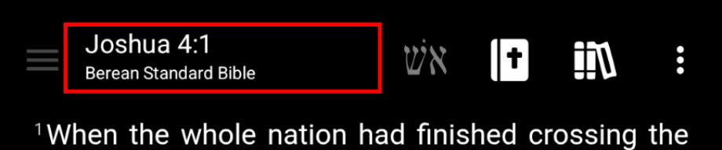
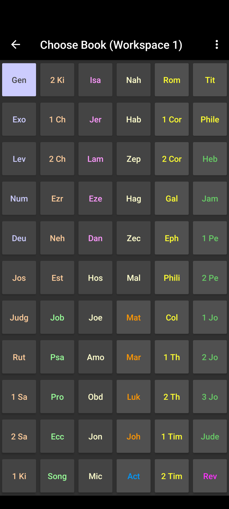
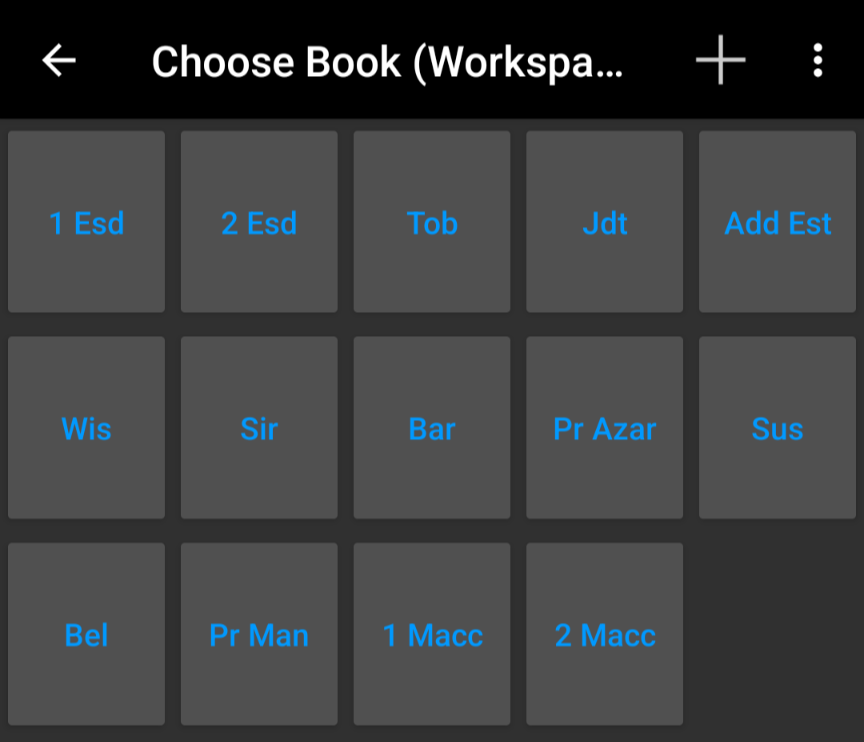
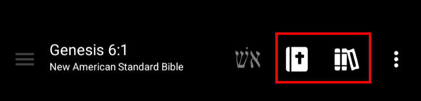
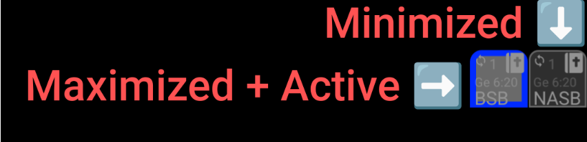
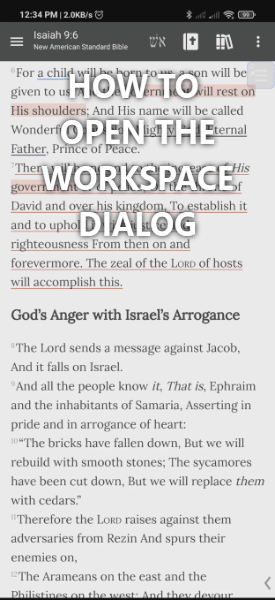
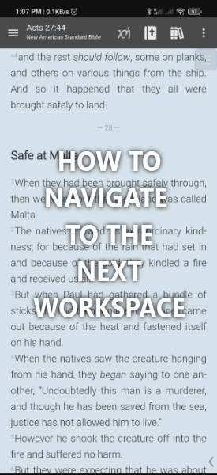

# Navigation

## Opening Bible References

To open a bible reference, simply click on the book name at the top of the screen:

[{ height="100" }](images/header-reference.png)

The *Book Chooser* will open where you can select any book that is available in
the current document. For example, in regular Bible documents you will be able
to see all 66 books of the Bible, but if you go to the *Book Chooser* when the
active window is a smaller commentary, it will only show the books that are
available in that commentary.

After you select the book, it will take you to the next screen where you can
select the chapter:

[{ width="200" }](images/book-chapter-chooser.png)

After selecting a book and then a chapter it will take you back to the Bible
screen and open the Bible to the selected reference.

### Book Chooser Customizations

A few customization options are available in the top right vertical three-dot menu
of the *Book Chooser* screen:

> - **Alphabetical Order:** Enabling this option will display the books in
>     alphabetical order. (Starting with numbers - i.e. 1 Chronicles)
> - **Order books horizontally:** Enabling this option will list the books from
>     left to right then from top to bottom.
> - **Group books by category:** Enabling this option will automatically enable
>     the *Order books horizontally* setting but will additionally group books by
>     their category (i.e. Law, History, Poetry, Prophets, etc.)
> - **Show long book name:** Enabling this option will additionally show the full
>     book name under its abbreviation.

### Opening Deuterocanonical Books

When your active window is a Bible version that contains deuterocanonical books,
there will be a plus (+) icon in the *Book Chooser*. By clicking on the plus (*+*)
icon, you will see a list of the included deuterocanonical books. For example,
when opening the KJVA Bible, you can click the “Book Chooser” and you should
see the plus (+) menu icon in the top right. Clicking the plus icon (+) will
display the deuterocanonical books in the list:

[{ width="200" }](images/book-chooser-deuterocanonical.png)

### Navigating Directly To Verse

If you would like to choose a specific verse number (in addition to the book and
chapter), you can enable the *Navigate to verse* option in Application preferences:

1. Click on the main menu (☰) on top left of the screen,
2. Click *Application preferences*
3. Find and enable the *Navigate to verse* setting.

Now after selecting the chapter number, you will be prompted to choose the exact
verse number you would like to open.

## Moving Between Documents

### Opening Documents

To open a document, click on either the Bible or Books icons in the top navigation bar.

[{ height="100" }](images/book-chooser-icons.png)
> - Clicking on the Bible icon will show a list of installed Bibles that you can open.
> - Clicking on the Books icon will show a list of other installed documents you can open (
>     i.e. Commentaries, Dictionaries, Generic books, etc).

By default each button opens a sheet. The Bible button lists your Bibles. The
other button is titled *Commentary* and lists commentaries, general books and
dictionaries. The tabs are *Recent*, *This verse* and *All*, and *All
documents…* at the bottom opens the full document list. If only two Bibles (or
books) are available for the current verse, the button switches directly to the
other one instead; if none are, it opens the full document list.

Note: This will open the document in the currently active window. To open a
document in a new window, see [Windows](windows.md).

The Bible and books toolbar buttons can also be customized. To customize the
actions, to to the top left main menu (☰) and click *Application
Preferences*. Click *Action for toolbar button press* to configure the custom
button actions:

> - Press to open menu, long press for documents screen (default)
> - Press to open next document, long press to open the document sheet (list of documents)
> - Press to open next document, long press to open documents screen

### Closing Documents

To close a document, click the ☰ menu at the top right of the document
you want to close and click *Close*. Alternatively, long-click on a bottom-right
window bar button and click *Close*.

### Maximizing/Minimizing Document Windows {#maximizing-minimizing-document-windows}

To maximize or minimize a window, click on the window icon in the bottom right
window button bar. Clicking on a window that is visible will minimize the window
and clicking on a window that is minimized will maximize it. Maximized window
buttons will have a grey background while minimized window buttons will have a
darker background. The window button that is highlighted indicates the active
window (which should also be maximized):

[{ height="100" }](images/window-buttons.png)

For more on managing windows, see [Windows](windows.md).

## Moving Between Workspaces

### Open the workspaces dialog

To open the workspace dialog, simply swipe down from the book reference section
of the top main toolbar. Alternatively, click the top right three-dot menu and
click *Workspaces*.

[{ height="400" }](images/workspace-dialog-open.gif)

### Go to the next workspace

To navigate directly to the next/previous workspace, you can swipe right or left
on the book reference section of the top main toolbar:

[{ height="400" }](images/workspace-move-to-next.gif)

For more information about managing workspaces, see [Workspaces](workspaces.md).

## Gestures and Shortcuts

*AndBible* supports a variety of gestures and shortcuts for efficient navigation.

### Swipe Left/Right on Bible Text {#swipe-left-right-on-bible-text}

You can swipe left or right on the Bible text to navigate. The behavior can be
configured in `Settings` > `Application behavior` > `Action for swipe
left/right gesture`:

- **Chapter** (default) – Navigate to the next or previous chapter.
- **Page** – Scroll by one page (like tapping the margin).
- **Disabled** – Swiping has no effect on the Bible text.

### Double-Tap to Fullscreen

Double-tap the Bible text to enter fullscreen mode, which hides the toolbar and
status bar for distraction-free reading. Double-tap again to exit fullscreen.

This feature is enabled by default and can be toggled in `Settings` >
`Application behavior` > `Double-tap to fullscreen`.

### Fullscreen by Scrolling

When enabled, the app automatically enters fullscreen mode when you start
scrolling the text, and exits fullscreen when you scroll back to the top.

To enable: `Settings` > `Application behavior` > `Fullscreen by
scrolling`.

### Volume Keys Scrolling

By default, the device volume buttons scroll the Bible text up and down instead
of adjusting the system volume. This is useful for hands-free reading.

To disable: `Settings` > `Application behavior` > `Volume keys scroll`.

### Long-Press Actions

Several buttons support long-press for quick access to additional features:

- **Back button** – Open the navigation history list.
- **Speak toolbar button** – Open speak settings directly.
- **Window button** (in the bottom bar) – Minimize the window instantly.
- **Verse location title** (top of screen) – Jump to the document selector.
