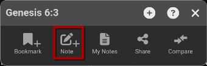
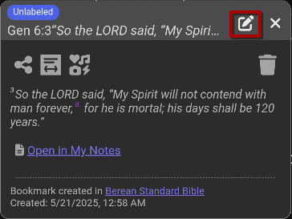
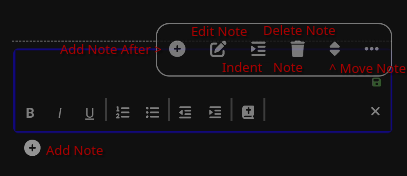
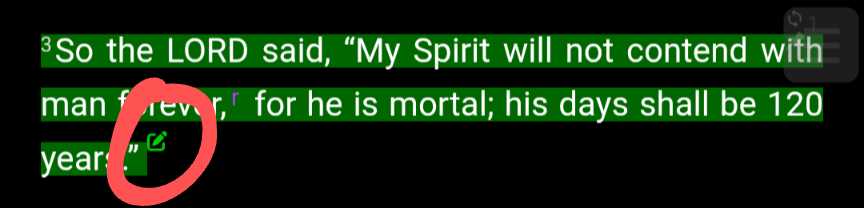
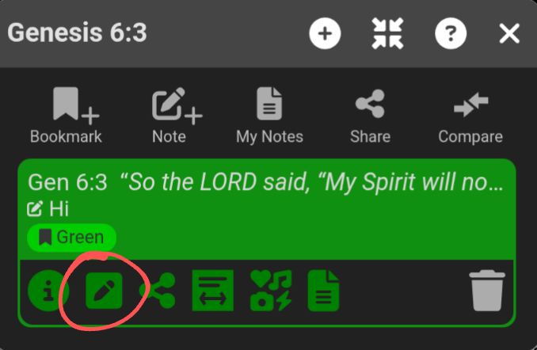
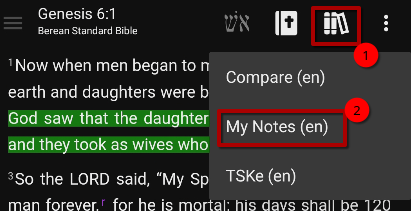
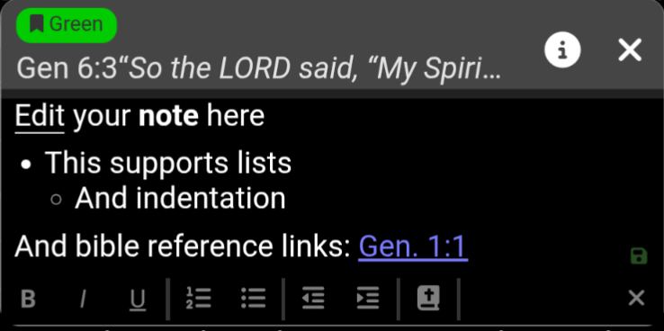

# Notes

*AndBible* allows you to add personal notes to any [bookmark](bookmarks.md)
or [study pad](study_pads.md).

https://www.youtube.com/watch?v=--Hr5LqBfmg

## Creating Notes

Notes can be created in a few different ways. When creating a note, changes are
saved automatically.

### Add a note from the verse action dialog:

1. Click a verse to open the [verse action dialog](verse_action_dialog.md).
2. Click the *Note* button to add a note.

    - This will automatically create a new bookmark with the [label](labels.md):
        ‘Unlabeled’.

> [{ .align-left width="340" height="110" }](images/verse-action-dialog-note-button.png)

### [Add a note to an existing bookmark:](videos/note_add_to_existing_bookmark.md)

1. Locate the [bookmark](bookmarks.md) where you would like to add a note.
2. Click the bookmark to display the [verse action dialog](verse_action_dialog.md).
3. Click the *Note* button to add a note to the bookmark.

### Add a note to a new bookmark:

1. [Create a Bookmark](bookmarks.md#creating-a-bookmark).
2. After selecting labels for your bookmark you will see the bookmark dialog.
3. Click the pencil icon at the top right of the bookmark dialog to add a note
    to the bookmark.

> [{ .align-left width="291" height="218" }](images/bookmark-dialog-note-button.png)

### Add a note to a study pad:

Notes can be added to a [study pad](study_pads.md). These notes will not be
visible in the document and will only be visible on the study pad.

1. Open a [study pad](study_pads.md).
2. At the bottom of the study pad (or in any of the three-dot menus) click the (+)
    icon to add a note.

This note will *not* be linked to a specific document or verse.
The note can be re-located in the study pad by clicking the three-dot menu next
to the note and dragging the up/down arrows to the position in the study pad
where you would like to locate the note.

> [{ .align-left width="488" height="211" }](images/study-pad-notes.png)

## Viewing notes

### Viewing an individual note:

Once a note has been added to a bookmark, a note icon will be displayed at the
end of the bookmark in the document text. To view the note, click the note icon.

> [{ .align-left width="432" height="104" }](images/verse-note-icon.png)

Alternatively, click the bookmark and then click the note icon in the bookmark that
is displayed in the verse action dialog.

> [{ .align-left width="407" height="265" }](images/verse-action-dialog-bookmark-note-icon.png)

### Viewing notes as a commentary:

To view all notes for the active Bible chapter, open the *My Notes* “document”
from the books menu:

> [{ .align-left width="411" height="211" }](images/open-my-notes.png)

### Viewing all notes:

To view and search all notes, open the Bookmark list from the top left main menu
(☰).

## Editing a note

To edit a note, simply [view a note](#viewing-an-individual-note)
and click into the note to start editing. When editing a note, changes are saved automatically.

Notes support rich formatting. *AndBible* offers two editor types: an **HTML editor**
and a **Markdown editor**. You can choose which editor is used for new notes in
the settings.

### Choosing the Editor Format

1. From the top left main menu (☰), click `Settings`.
2. Under the notes settings, find `Format for new bookmark notes`.
3. Select either **HTML** or **Markdown**.

This setting applies to newly created notes and study pad entries. Existing
notes keep the format they were created with.

### HTML Editor

The HTML editor provides a toolbar with standard formatting options:

- **Bold**, **Italic**, **Underline**
- Ordered and unordered **lists**
- **Indentation** (increase / decrease)
- **Bible reference link** insertion

To add a Bible reference link:

> - Click the Bible icon and type a Bible reference.
> - Alternatively, you can click the Bible icon and click the “pointing hand” icon
>     to use the verse picker to choose the verse you want to link to.
>
> [{ .align-left width="443" height="221" }](images/note-editing.png)

### Markdown Editor

The Markdown editor lets you write notes using Markdown syntax. It provides a
formatting toolbar and a live text editing area.

The toolbar includes:

- **Heading** selector (H1–H3)
- **Bold**, **Italic**, **Underline**
- Ordered and unordered **lists**
- **Indentation** (increase / decrease)
- **Undo / Redo**
- **Bible reference link** insertion

The editor also supports these conveniences:

- **Auto-list continuation**: pressing Enter on a list item creates the next
    item automatically.
- **Auto-save**: changes are saved automatically after a short delay.
- **Keyboard shortcuts**: Ctrl+Z for undo, Ctrl+Y (or Ctrl+Shift+Z) for redo,
    Escape to close the editor.
