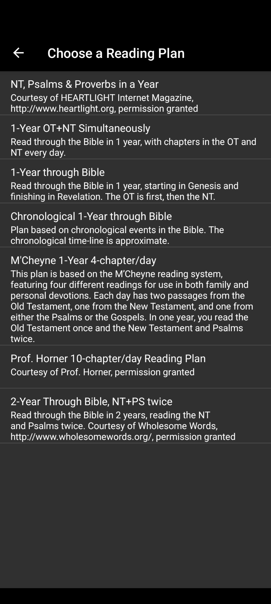
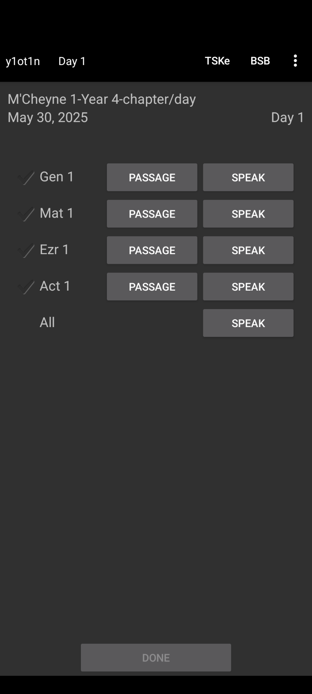
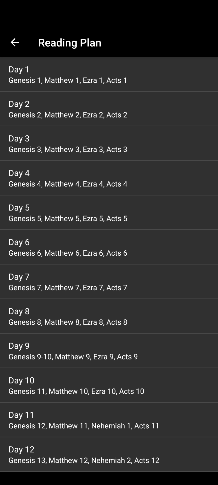

# Reading Plans

Reading plans provide a pre-determined schedule of scripture readings.
To access reading plans, navigate to the left main menu (☰) and choose
*Reading Plan*.

When first accessing *Reading Plan*, you will be prompted to select a plan. After
selecting a plan, you will be shown the Daily Reading screen for the first day
of the reading plan’s schedule.

Clicking the *Done* button will take you to the next day’s reading schedule.
Note: The *Done* button will only be enabled after pressing either the *Speak*
or *Passage* buttons for each passage that is listed. Alternatively, you can tap
the check next to each passage to enable the *Done* button (manually checking
the check marks can be useful if you’re reading in a paper Bible).

[{ style="width: 32%" }](images/reading-plan-list.png) [{ style="width: 32%" }](images/reading-plan-daily-readings.png) [{ style="width: 32%" }](images/reading-plan-days.png)

## Abandon Reading Plan

Press the vertical 3-dot menu from the *Daily Reading* screen, and click *Reset*.
Next time you return to the same *Reading Plan*, the progress will be reset to day 1.

## Switch Between Reading Plans

From the *Daily Reading* screen, click the first button in the top lef of the
toolbar. This will let you select a different reading plan. You can return to
the original reading plan and your progress will remain where you left it.
In other words, it is possible to use several reading plans simultaneously.

## Preview Reading Plans or Go To Specific Day

When in the *Daily Reading* screen, click the second button in the top left of
the toolbar. You will see a list of daily readings. Clicking on a daily reading
will bring you to *Daily Reading* screen for that specific day.

## Changing Reading Plan Start Date

To set the start date of a reading plan, select the vertical 3-dot menu from
the *Daily Reading* screen and click *Set Start Date…* to pick a specific
start date.

## Set Specific Reading Plan Day to Today’s Date {#set-specific-reading-plan-day-to-today-s-date}

This is useful if you started reading on a previous day and have just switched
to *AndBible*. To update the current reading plan day to today’s date:

1. Open the *Daily Reading* screen for the reading plan you would like to adjust
2. Go to the specific day of the reading plan you want to set to today’s date.
3. Click the top right 3-dot menu
4. Click *Set as current day*.

# Custom Reading Plans

It is possible to create your own custom reading plan for use with *AndBible*.

!!! note

    If you create a reading plan that you think would be useful for other *AndBible* users,
    feel free to share it in our [Matrix or Telegram](support.md#general-questions)
    chat!

## The .zip Reading Plan Format

For a sample reading plan in .zip format, please see
[this file](https://andbible.github.io/data/andbible/beta/zip/NinetyDaysReadingPlan.zip).
This is a complete reading plan file that is ready to be imported into *AndBible*.
It can be imported using the [Backup and Restore](backup_restore.md) functionality in the main menu
(☰), or from the top right vertical 3-dot menu in the *Reading Plan* screen.

The compressed zip folder contains two directories:

> - `mods.d` (Contains the `.conf` file)
> - `modules` (Contains the `.properties` file)
>
>     - Note: The `` modules` `` directory often has a longer path of folders
>     - leading to the `.properties` file. See the `.conf` file
>         `DataPath` property below for an example.

Once you are done preparing the `mods.d` and `modules` folders,
compress the 2 folders into a single `.zip` file. This zip file can then
be imported to *AndBible*.

!!! hint

    Use a simple text editor to create the file e.g. Notepad++ and do not use
    something like Word.

## The `.conf` file

For a sample `.conf` file, please see
[this file](https://andbible.github.io/data/andbible/beta/mods.d/NinetyDaysReadingPlan.conf).

This is the content of the *Ninety days* reading plan `.conf` file:

```
[NinetyDaysReadingPlan]
DataPath=./modules/texts/ztext/NinetyDaysReadingPlan/
Version=1.0
Description=Through the Bible in 90 days
ShortPromo=Challenge yourself and read through the entire Bible in 90 days
DistributionLicense=Public Domain
Category=And Bible
ModDrv=RawGenBook
Versification=KJV
AndBibleMinimumVersion=535
AndBibleProvidesReadingPlan=NinetyDaysReadingPlan.properties
```

A few notes about the contents of this file:

> - `Category` must be `And Bible`
> - `ModDrv` must be `RawGenBook`
> - The default `Versification` is always KJV, so this only needs to be
>     provided if you want a versification other than KJV. For more about
>     versification, see [here](https://wiki.crosswire.org/Alternate_Versification).
> - `AndBibleMinimumVersion` must be `535` because that’s the version
>     of *AndBible* when the zip format was first supported. Earlier versions of *AndBible*
>     will use this to determine that this module is not supported.
> - `AndBibleProvidesReadingPlan` should be set to the file name that exists
>     in the `DataPath` set at the start of the file.

!!! note

    If your reading plan is date-based you will need to add the following line
    to the `.conf` file:

    `AndBibleReadingPlanDateBased=true`

## The `.properties` file

You will need to create a `.properties` file similar to the examples
[here](https://github.com/AndBible/and-bible/tree/master/app/src/main/assets/readingplan)
The name of the file will be the name of the plan. The file extension must be
`.properties` and you must place it a sub-directory under the `modules`
directory. These will be translated to the current language when displayed in
*AndBible*. The file must contain a series of rows in the following format:

```
1=Gen.1, Matt.1
2=Gen.2, Matt.2
3=Gen.3, Matt.3
4=Ps.119
5=1Cor.1, Jude
```

It is possible to skip days. For example, if you do not wish to have a reading on the
weekend:

```
1=Gen.1, Matt.1
3=Gen.2, Matt.2
```

You can also add a date-based reading plan, which includes the month and day
number for each day. The date-based plan will always open at today’s date by
default (The regular plan opens the current day, which is the last day you haven’take
yet completed). For a date-based plan, the `.properties` file must always
begin the readings at `1=`, and the date must be in the format of 3 letters
for the month, then a dash and then a month day number followed by semicolon (;).
For example:

```
1=Jan-1;Gen.1-2,Ps.1-2,Matt.1-2
2=Jan-2;Gen.3-4,Ps.3-5,Matt.3-4
3=Jan-3;Gen.5-6,Ps.6-8,Matt.5
...
146=May-26;Jos 12,Isa 16,2Tim 2
...
334=Nov-30;Est 7-8,Oba,Heb 3-5
```

As mentioned in [the .conf file](#the-conf-file) section, you must add the following line to
the `.conf` file when using a date-based plan:

`AndBibleReadingPlanDateBased=true`

Example reading plans can be found
[here](https://github.com/AndBible/and-bible/tree/master/app/src/main/assets/readingplan).

!!! note

    [OSIS](https://crosswire.org/osis/) format references and Bible
    book names must be used in reading plans.

    A full list of OSIS book names can be found
    [here](https://wiki.crosswire.org/OSIS_Book_Abbreviations).

## Cloud Sync

Your reading plans and their progress can be synchronized across devices using
[cloud sync](cloud_sync.md). Enable the **Reading Plans** toggle in the cloud
sync settings.
