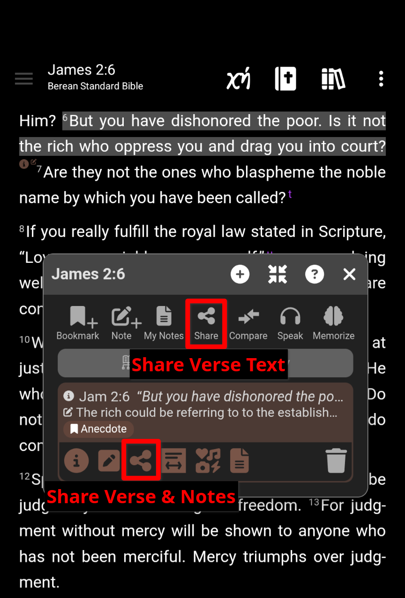
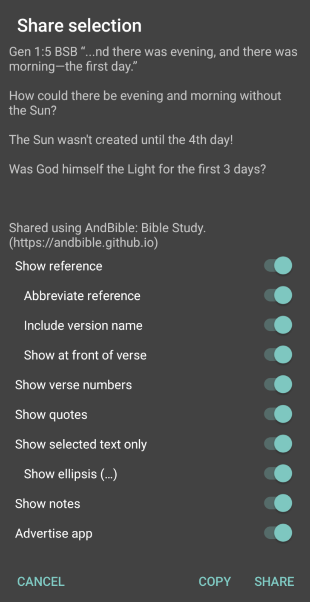
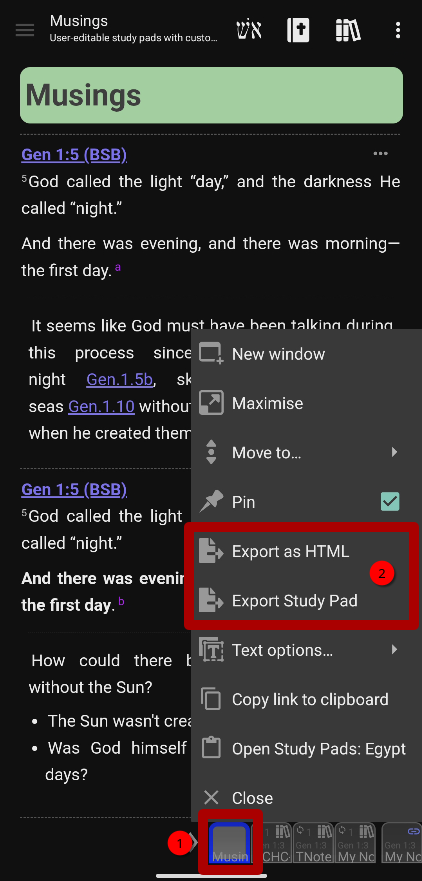

# Sharing

With *AndBible*, you can easily share verses, notes, and study pads.

[{ height="400" }](https://play.google.com/store/apps/details?id=net.bible.android.activity)

## Sharing A Verse

1. Click on the verse you would like to share.
2. In the [Verse Action Dialog](verse_action_dialog.md), click the *share* button.

    - To share notes in addition to the verse text, click the *share* button
        in the specific note you would like to share.
3. Toggle the items that you want to include in the shared text.
4. Click *COPY* to copy the text to your clipboard, or click *SHARE* to share
    the text via another app.

[{ height="500" }](https://play.google.com/store/apps/details?id=net.bible.android.activity)

## Sharing A Study Pad

[Study Pads](study_pads.md) can be shared with other *AndBible* users, or with anyone in html
format:

1. Open a StudyPad (See [Study Pads](study_pads.md) for more details)
2. Long-Click on the study pad window button
3. In the window menu, choose:

    - *Export as HTML* to export an html file that can be shared with anyone.
    - *Export Study Pad* to export a study pad file that can be imported
        by other *AndBible* users.
4. When prompted, choose either to save the exported study pad to your
    *Phone Storage* or to *Share* it via another app.

[{ height="500" }](https://play.google.com/store/apps/details?id=net.bible.android.activity)

## Sharing Bibles/Documents {#sharing-bibles-documents}

It is also possible to share other *AndBible* documents. See [Backup and Restore](backup_restore.md)
for details on backing up documents that can then be shared with other
*AndBible* users.

## Sharing Bible Links

You can share a direct link to a specific Bible passage using the
`https://read.andbible.org/` URL format. When another *AndBible* user opens the
link, it opens the passage directly in the app.

For more details on the link format and options, see [Bible Links / Deep Linking](bible_links.md).
