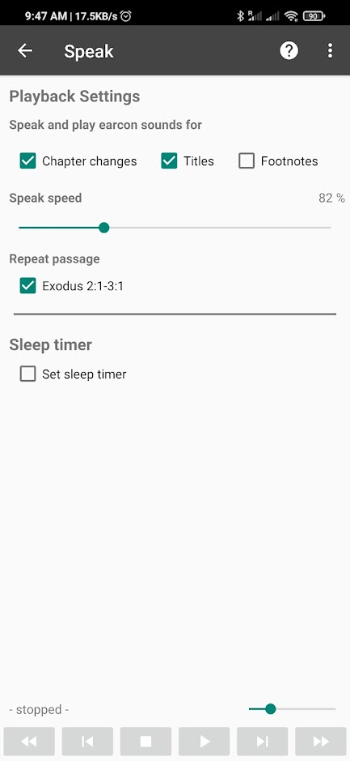

# Speak

## Voice used for speaking

*AndBible* uses the [Text to Speech](https://www.lifewire.com/use-google-text-to-speech-on-android-4767200) functionality of your device
to speak the text of the Bible, commentaries and books. The quality and listenability of these voices varies greatly and is not something we control.
Most devices allow you to choose a different voice and modify pitch and speed. You can also install 3rd party Text-to-Speech engines which may
be superior to the default voices.

The way in which you change the voice differs between devices. Try searching in Settings for `Text-to-Speech > Preferred engine > Install voice data`.

## Speak Settings

The *Speak* dialog can be accessed from:

- Menu `☰ > Speak`
- Playback control menu that is visible at the bottom of the screen when speech has been started.

| Speak and play earcon sounds for |  |
| --- | --- |
| *Chapter Changes* | Plays a short sound when a new chapter is reached. |
| *Titles* | Read the titles that translators have added to the Bible text. |
| *Footnotes* | Read the footnotes included in the Bible text. |
| **Speak speed** | The speed that the text will be read. |
| **Repeat passage** | Repeat the range of verses specified. |
| **Sleep timer** | Stop the playback after the number of minutes specified. |

## How to speak a range of verses

1. Tick the `Repeat passage` box. This will show the verse selector.
2. Choose the book, chapter and verse at which to start.
3. Then choose the book, chapter and verse at which to end.
4. The range will now be displayed.
5. Push the play `▶` button at the bottom of the screen to start playback.

[{ .align-center style="width: 300px" }](images/speak-page.jpg)

## Earcon Sounds

Earcon sounds are short audio cues that play during speech to indicate
transitions in the text. The speak settings let you enable or disable earcon
sounds for:

- **Chapter changes** – a sound plays when a new chapter begins.
- **Titles** – section titles added by translators are read aloud.
- **Footnotes** – footnotes included in the Bible text are read aloud.

## Sleep Timer

The sleep timer automatically stops playback after the specified number of
minutes. This is useful when listening to the Bible before falling asleep. Set
the timer in the Speak settings dialog by entering the number of minutes.

## Bluetooth Media Buttons

*AndBible* can respond to Bluetooth media buttons (play/pause on headsets,
car audio systems, etc.) to start and stop text-to-speech playback.

This feature is enabled by default. To disable it, go to `Settings` >
`Advanced` > `Enable Bluetooth media buttons`.
